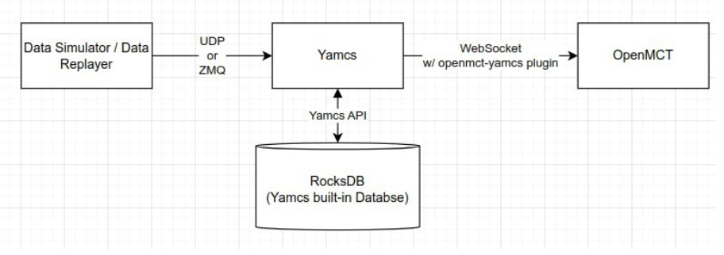
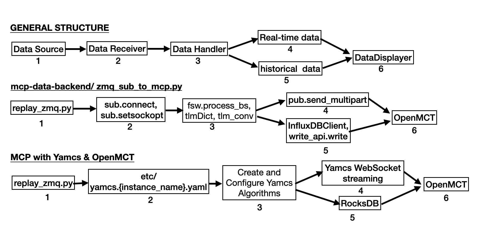

# MCP-Yamcs+OpenMCT

This GitHub repository aims to integrate OpenMCT with Yamcs, using Yamcs as the backend and OpenMCT as the frontend.

**Project Duration:** 3 months (Starting from July 1st, 2024)

## Project Overview

The project is divided into four main parts:

1. **Environmental Set-Up Guide**
2. **Implementation Challenges and Solutions**
3. **Telemetry Data Format Explanation**
4. **Step-by-Step Manual**

### General Concept

The primary goal is to replace the original Python script with a Yamcs backend. The project structure is visualized as follows:

### Project Breakdown

The project can be broken down into six key steps:

1. **Data Source to Server Port:** 
   - Data is sent from the Data Source (such as a Data Simulator or Data Replayer) via UDP/ZMQ to the Server Port (Yamcs).
   
2. **Port to Preprocessor:** 
   - The Port maps the data to the Preprocessor.
   
3. **Preprocessor to Data Handler:** 
   - The Preprocessor maps the protocol to the Data Handler.
   
4. **Data Handling:** 
   - The Data Handler converts telemetry data into human-readable formats.
   - The Data Handler also stores the data in the Database.
   
5. **Data Transfer to OpenMCT:** 
   - Data is transferred from the server database (RocksDB) to OpenMCT via WebSocket.

### Current Progress

As of now, the original "simulator.py" script has been replaced with "replay_zmq.py."

---

If you have any ideas or suggestions, please feel free to reach out!
